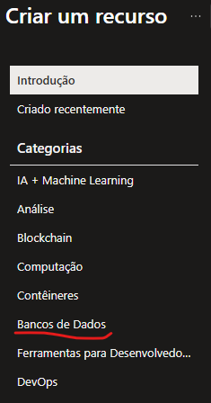
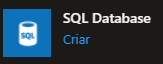
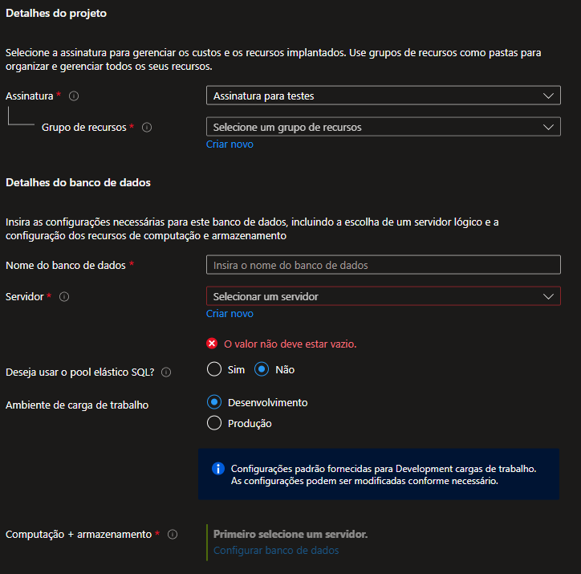
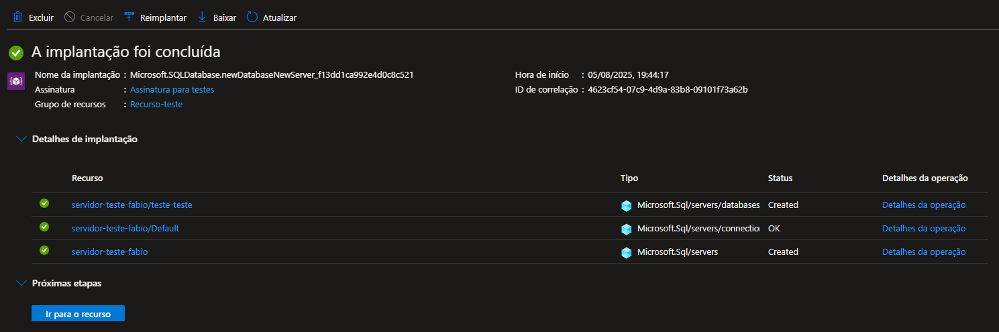

# Criando uma instância de banco de dados na Azure

## Introdução
Um banco de dados nada mais é que um repositório de armazenamento de informações oriundas de uma aplicação, como um sistema web, uma aplicativo ou outra fonte de input de informações. 
Existem vários tipos de banco de dados, mas os mais utilizados são:
1.  📚**Relacional**
* Descrição: Organiza os dados em tabelas com colunas e linhas.
* Baseado em: Álgebra relacional.
* Exemplos: MySQL, PostgreSQL, SQL Server, Oracle.
* Ideal para: Dados estruturados com relações bem definidas (ex: sistemas de gestão).

2. 🧩**Não Relacional (NoSQL)**
* Descrição: Mais flexível, não usa o modelo de tabelas tradicional.
    * Subtipos
        * Documentos: Armazena dados em formato JSON/BSON. 
        Ex: MongoDB
        * Colunar: Armazena dados por coluna, ideal para analytics. 
        Ex: Apache Cassandra
        * Chave-valor: Dados armazenados como pares chave/valor.
        Ex: Redis, DynamoDB
        * Grafos: Focado em relacionamentos complexos.
        Ex: Neo4j, ArangoDB
* Ideal para: Grandes volumes de dados, estruturas flexíveis, performance.

## Características Principais de um banco de dados na nuvem
1. ✅ Acesso remoto

* Pode ser acessado de qualquer lugar, desde que haja conexão com a internet.

2. ⚙️ Gerenciamento automatizado

* O provedor de nuvem (como AWS, Azure, Google Cloud) cuida de tarefas como backup, atualização, segurança, escalabilidade etc.

3. 📈 Escalabilidade fácil

* É possível aumentar a capacidade (armazenamento, processamento) com poucos cliques.

4. 💸 Custo sob demanda (pay-as-you-go)

* Você paga apenas pelo que usa, em vez de manter servidores próprios ociosos.

5. 🔐 Segurança gerenciada

* Fornecedores investem em alta segurança (criptografia, autenticação, etc.), embora o desenvolvedor ainda tenha responsabilidade pela configuração adequada

🧠 Vantagens: 
* Não precisa manter servidores físicos
* Alta disponibilidade e recuperação de desastres
* Integração com outras ferramentas em nuvem
* Rápida implantação de aplicações

⚠️ Desvantagens: 
* Dependência de conexão com a internet
* Pode haver custos inesperados se mal configurado
* Privacidade e conformidade devem ser cuidadosamente gerenciadas

## Como configurar um banco de dados na Azure
Acesse o site https://portal.azure.com/ e use as suas credenciais para acessar o portal  
* No menu principal, clique em "Criar um recurso"     
* No menu lateral à esquerda clique quem "Banco de dados"     
* Nas opções que aparecerem ao centro, clique em "SQL Database"    
* Preencha as informações para criar o banco de dados      

Após todo o preenchimento, seu banco de dados estará criado e pronto para uso.  

