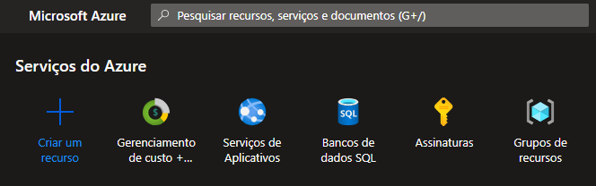

# Construindo Arquiteturas no Azure

## Introdução
Neste tutorial, vamos aprender como criar um Grupo de Recursos no Azure 

1.  Acesse o portal do Azure https://portal.azure.com/

2. Após fazer o login no portal, na barra de pesquisa ou nos serviços que aparacem logo no início, pesquise por Grupo de Recursos  

3. Após acessar a tela de Grupo de Recursos, clique em "Criar"  

4. Em seguida, preencha as informações nos campos obrigatórios e clique em "Revisar e criar"  

5. Em seguida a tela de revisão será exibida. Confirme as informações e depois clique em criar.  

